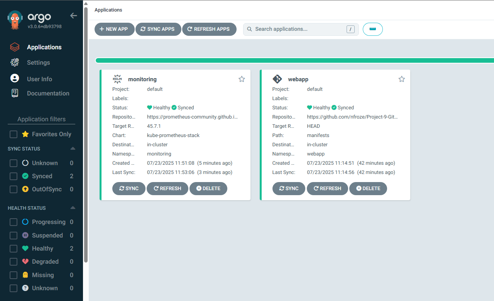
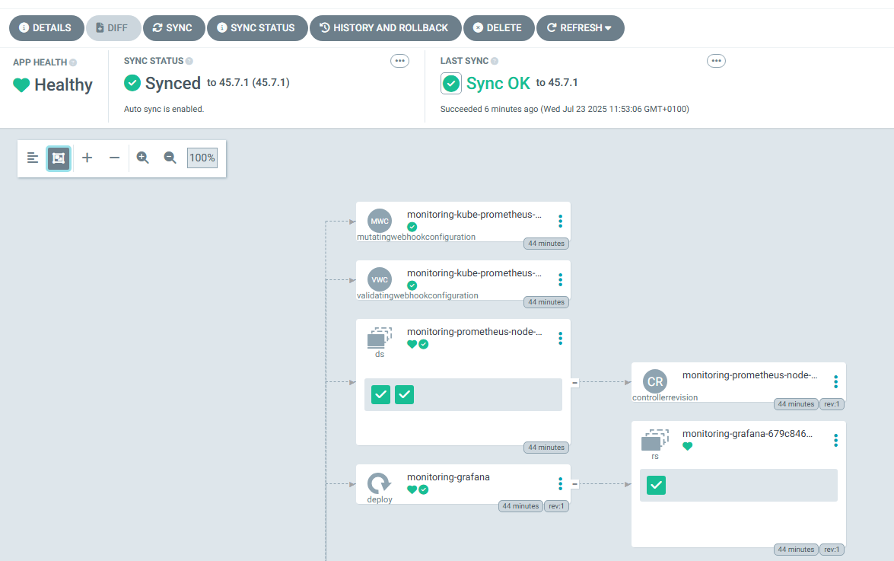
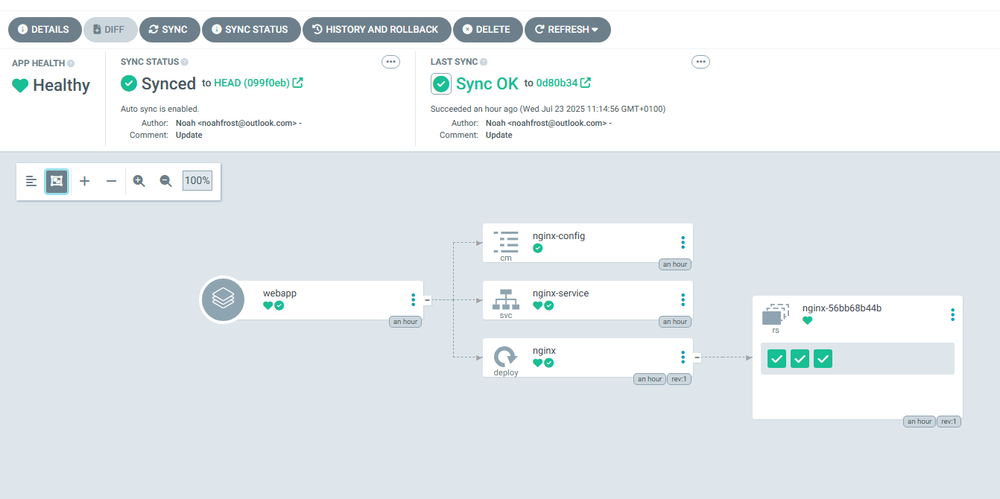
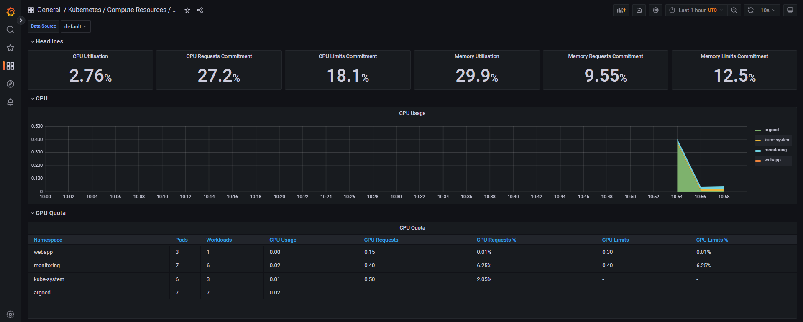
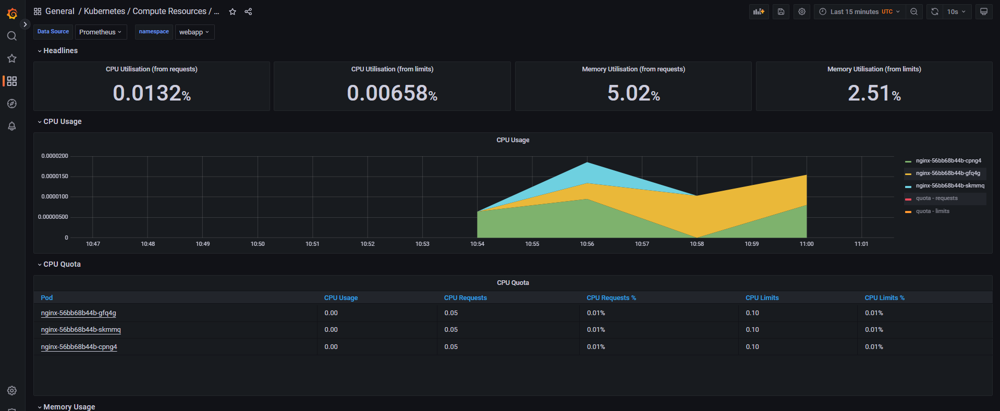
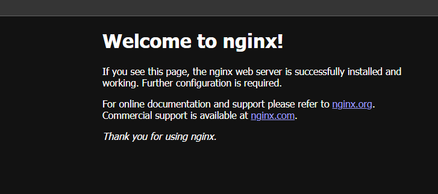
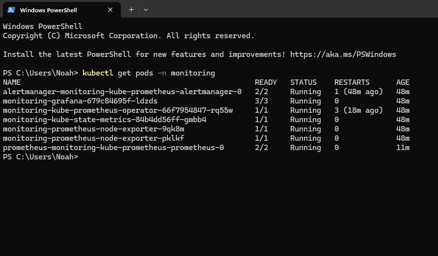
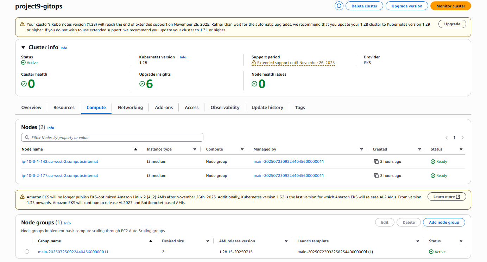

# 🚀 Project 9: GitOps Monitoring

Production-grade GitOps implementation demonstrating automated Kubernetes deployments and comprehensive observability.

## 🎯 What I Built

Implemented a complete GitOps workflow on AWS EKS where Git commits automatically trigger deployments through ArgoCD, with full observability via Prometheus and Grafana. Successfully debugged and resolved complex Helm chart deployment issues, demonstrating real-world troubleshooting skills.

## 🛠️ Technologies Used

- **AWS EKS** - Managed Kubernetes cluster in eu-west-2
- **Terraform** - 100% Infrastructure as Code
- **ArgoCD** - GitOps continuous deployment operator
- **Prometheus** - Metrics collection and alerting
- **Grafana** - Visualization and dashboards
- **Helm** - Package management via ArgoCD

## 📦 Architecture

- **GitOps Pattern**: Push code → ArgoCD detects → Automatic deployment
- **Monitoring Stack**: Prometheus scrapes all metrics → Grafana visualizes
- **Self-Healing**: ArgoCD continuously ensures cluster matches Git state
- **Declarative Everything**: No manual kubectl commands in production

## 📸 Screenshots

### GitOps in Action

*ArgoCD dashboard showing both applications synced and healthy*

*Monitoring application details showing all Prometheus/Grafana components*

*Webapp application details showing deployed resources*

### Observability Platform

*Grafana cluster dashboard displaying real-time CPU and memory metrics*

*Namespace view showing webapp pods and their resource usage*

### Running Applications

*Live web application deployed via GitOps*

*All monitoring stack pods running successfully including Prometheus server*

### Infrastructure

*EKS cluster with nodes and node groups in AWS Console*

## 🔧 Key Implementations

1. **Automated Deployments**
   - ArgoCD monitors this Git repository
   - Any change to `/manifests` triggers automatic sync
   - Rollback is just a Git revert

2. **Comprehensive Monitoring**
   - Full cluster metrics (CPU, memory, network)
   - Application-level monitoring
   - Pre-built dashboards for instant visibility
   - Successfully troubleshot Prometheus CRD deployment issues

3. **Security & Best Practices**
   - GitOps provides complete audit trail
   - No direct cluster access needed
   - All changes tracked in version control

## 📊 Results

- Deployment time: Git push → Running pods in <2 minutes
- Zero manual intervention required
- Complete observability from day one
- Successfully debugged complex CRD issues using ServerSideApply
- Infrastructure reproducible from code

## 💡 Real-World Application

This setup mirrors production environments where:
- DevOps teams manage hundreds of microservices
- Deployments need audit trails for compliance
- Self-healing reduces operational burden
- Monitoring prevents issues before they impact users
- Engineers must troubleshoot complex Helm and CRD issues

## 🚀 Technical Challenges Overcome

- Resolved Prometheus server deployment failure due to CRD size limitations
- Implemented ServerSideApply to handle large Kubernetes resources
- Debugged DNS resolution issues with EKS endpoint configuration
- Fixed Terraform module defaults for public endpoint access

---

**View my other projects**: [GitHub Profile](https://github.com/nfroze)